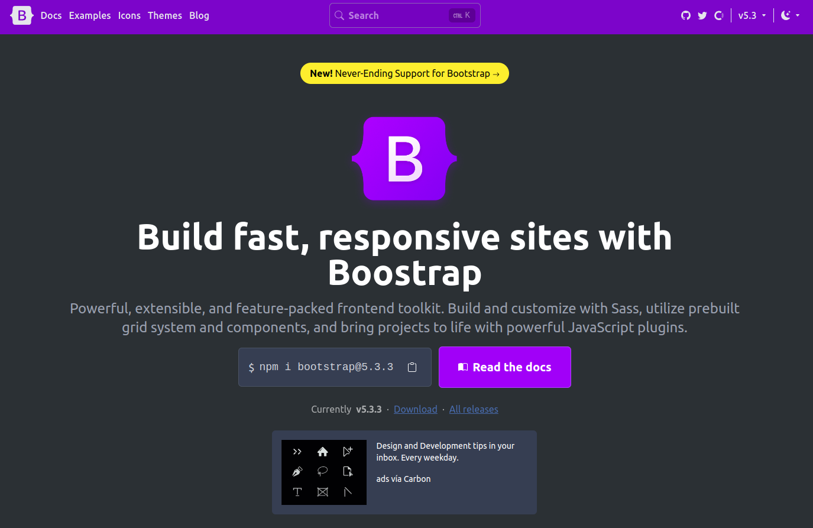

<div align="center">
  <h2>Bootstrap's HomePage</h2>
  <p>
    Solo Layout
  </p>
  </img>
</div>

## 📜 Description

- Due to its practicality, **Vite** was chosen to initialize, minify, and create the production *bundle*.
- **React**, **TailwindCSS** and **Shadcn/ui** were used to quickly layout complex components.
- The project is deployed on [**Netlify**](https://roaring-bublanina-1b1a88.netlify.app/). Additionally, the final code is dockerized for local testing.

## 🚀 Getting Started

### **Online Version**

Use this [link](https://roaring-bublanina-1b1a88.netlify.app/ "Probar Demo") to try the code deployed on Netlify.


### **Local Version**
1. Run the following commands for *Linux*. You must have [**Docker**](https://docs.docker.com/engine/install/) and its [**post-installation**](https://docs.docker.com/engine/install/linux-postinstall/) set up beforehand.

```bash
# Download the latest image from DockerHub:
docker pull deglanrivas/layout-tailwind-clonbootstrap:latest

# Create a container based on that image:
docker run --rm -d -p 8080:80 --name demo_container deglanrivas/layout-tailwind-clonbootstrap:latest

```

2. Open [**http://localhost:8080**](http://localhost:8080/) in your browser to see the result 🚀

3. Once the test is complete, remove the image and container:
```bash
# Stop the containers:
docker stop demo_container && docker rmi deglanrivas/layout-tailwind-clonbootstrap:latest

# Verify they were correctly removed:
docker images
docker ps -a
```